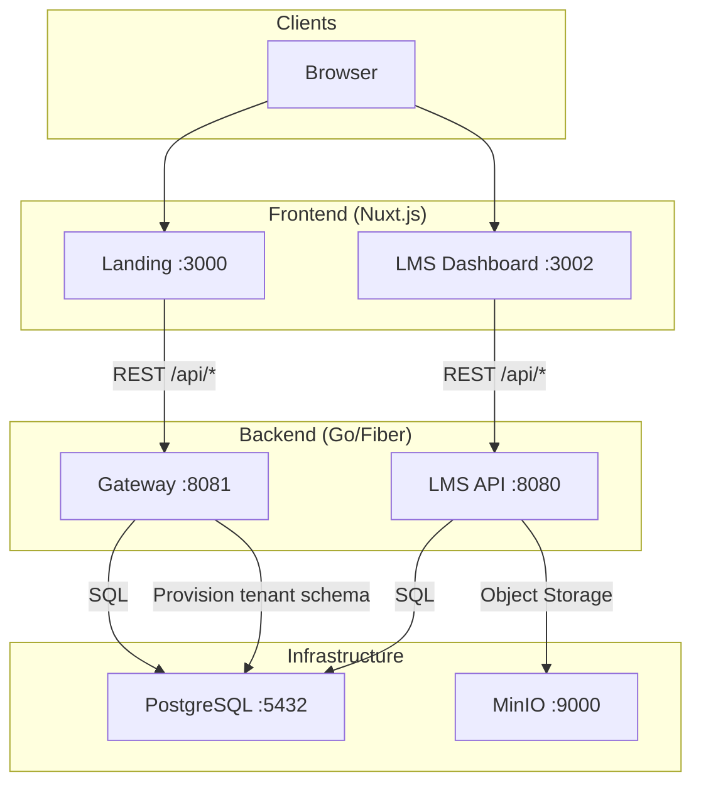
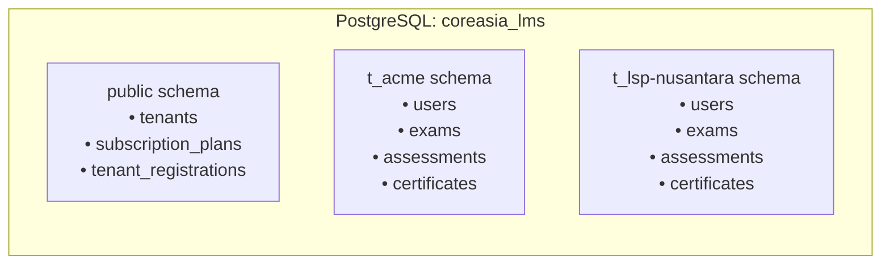
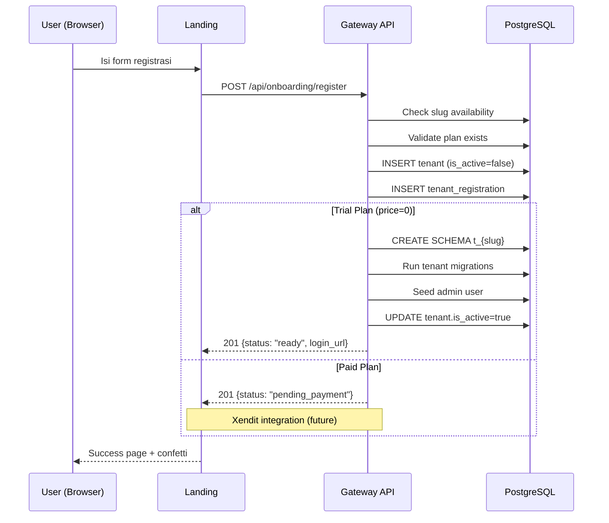

# CoreAsia – Arsitektur Monorepo Microservices

## Overview

CoreAsia menggunakan **monorepo** dengan **microservices architecture** untuk platform LMS SaaS multi-tenant.

**Keputusan Monorepo:**
- Tim kecil (1-3 developer) → monorepo lebih efisien dari polyrepo
- Shared migrations & config terpusat
- Atomic commits lintas service
- Single CI/CD pipeline

---

## Directory Structure

```
coreasia/
├── backend/
│   ├── gateway/              # Onboarding, billing, tenant provisioning
│   │   ├── cmd/server/       # Entry point (:8081)
│   │   ├── internal/
│   │   │   ├── config/       # Env + YAML config loader
│   │   │   ├── handler/      # Fiber HTTP handlers
│   │   │   ├── model/        # Domain models & DTOs
│   │   │   ├── repository/   # PostgreSQL queries
│   │   │   └── service/      # Business logic (Provisioner)
│   │   └── pkg/              # Shared utilities (apperr, validate)
│   │
│   └── lms/                  # Core LMS engine (per-tenant)
│       ├── cmd/server/       # Entry point (:8080)
│       ├── internal/
│       │   ├── domain/       # Clean Architecture domain layer
│       │   ├── application/  # Use cases & DTOs
│       │   ├── infrastructure/
│       │   └── interfaces/   # HTTP handlers
│       ├── migrations/
│       │   ├── global/       # Public schema (tenants, plans)
│       │   └── tenant/       # Per-tenant schema (users, exams, etc.)
│       └── sqlc/
│
├── frontend/
│   ├── landing/              # Public marketing site (Nuxt.js :3000)
│   │   ├── pages/            # pricing, register, contact, etc.
│   │   ├── composables/      # useGatewayApi, useScrollReveal
│   │   └── components/       # UI components
│   │
│   └── lms/                  # Tenant dashboard (Nuxt.js :3002)
│       ├── app/
│       │   ├── adapters/     # Backend DTO → UI domain
│       │   ├── components/   # Atomic Design (atoms→organisms)
│       │   ├── composables/  # Data fetching hooks
│       │   ├── pages/        # Route-based pages
│       │   ├── services/     # API client layer
│       │   ├── stores/       # Pinia state management
│       │   └── types/        # TypeScript interfaces
│       └── server/           # Nuxt server routes
│
├── docs/                     # Documentation
├── docker-compose.dev.yml    # Development orchestration
└── README.md
```

---

## Service Map



---

## Database Strategy: Schema-per-Tenant

PostgreSQL single instance, isolasi via **schema per tenant**.



| Aspek | Detail |
|-------|--------|
| **Naming** | `t_{slug}` prefix untuk hindari konflik |
| **Provisioning** | Gateway `Provisioner` service: CREATE SCHEMA → migrate → seed admin |
| **Migrations** | `migrations/global/` untuk public schema, `migrations/tenant/` untuk tiap tenant |
| **Isolasi** | Tiap tenant punya tabel sendiri, tidak bisa akses tenant lain |
| **Cocok untuk** | < 500 tenant (B2B SaaS model CoreAsia) |

---

## Communication Flow

### Tenant Registration Flow



### Service Boundaries

| Service | Tanggung Jawab | Port |
|---------|---------------|------|
| **Gateway** | Onboarding, billing, tenant management, plan CRUD | 8081 |
| **LMS API** | Per-tenant operations: users, exams, assessments, certificates, QR | 8080 |
| **Landing** | Marketing pages, pricing, registration form | 3000 |
| **LMS Frontend** | Tenant dashboard, admin panel | 3002 |

**Rules:**
- ✅ Landing → Gateway (REST)
- ✅ LMS Frontend → LMS API (REST)
- ❌ Service-to-service direct calls (tidak ada)
- ❌ Shared business logic antar services

---

## Tech Stack

| Layer | Technology |
|-------|-----------|
| **Backend** | Go 1.24+, Fiber v3, pgx v5 |
| **Frontend** | Nuxt.js 3, TypeScript, Tailwind CSS v4 |
| **Database** | PostgreSQL 17 |
| **Storage** | MinIO (S3-compatible) |
| **Dev Tools** | Air (hot-reload), Docker Compose, Bun |
| **Auth** | JWT + bcrypt (per-tenant) |
| **Validation** | go-playground/validator (backend), Zod-style (frontend) |

---

## Roadmap

| Phase | Service | Feature |
|-------|---------|---------|
| ✅ v1.0 | LMS API | Core CRUD, multi-tenant, CBT, certificates |
| ✅ v1.0 | Gateway | Onboarding, provisioning, plans |
| ✅ v1.0 | Landing | Pricing, registration, marketing pages |
| 🔲 v1.1 | Gateway | Xendit payment integration |
| 🔲 v1.2 | Gateway | Notification service (email + WhatsApp) |
| 🔲 v1.3 | LMS API | BNSP export, advanced reporting |
| 🔲 v2.0 | Gateway | Analytics dashboard, usage metering |
